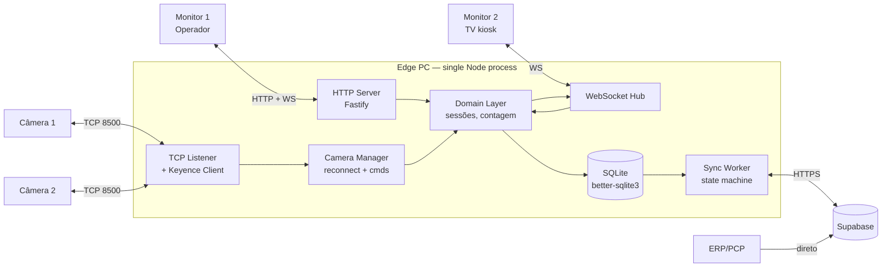
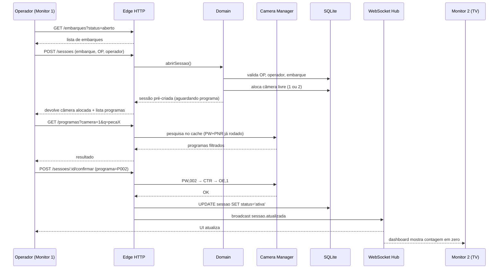
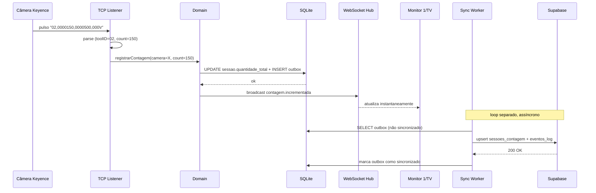
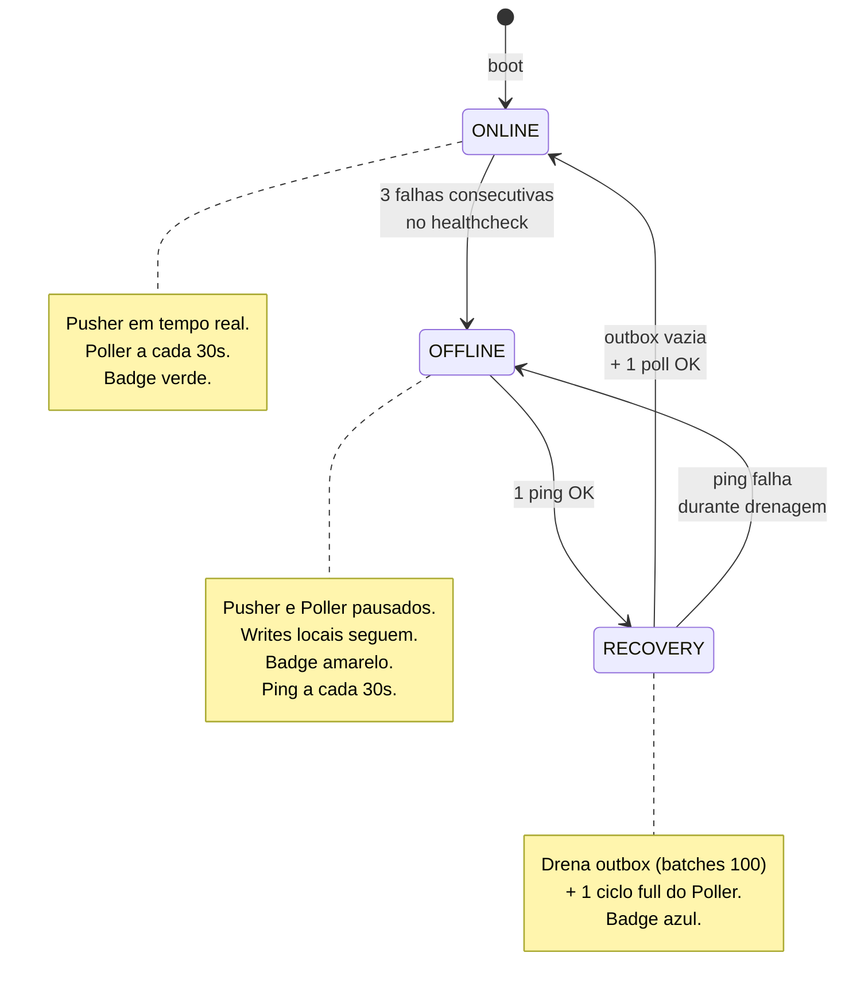
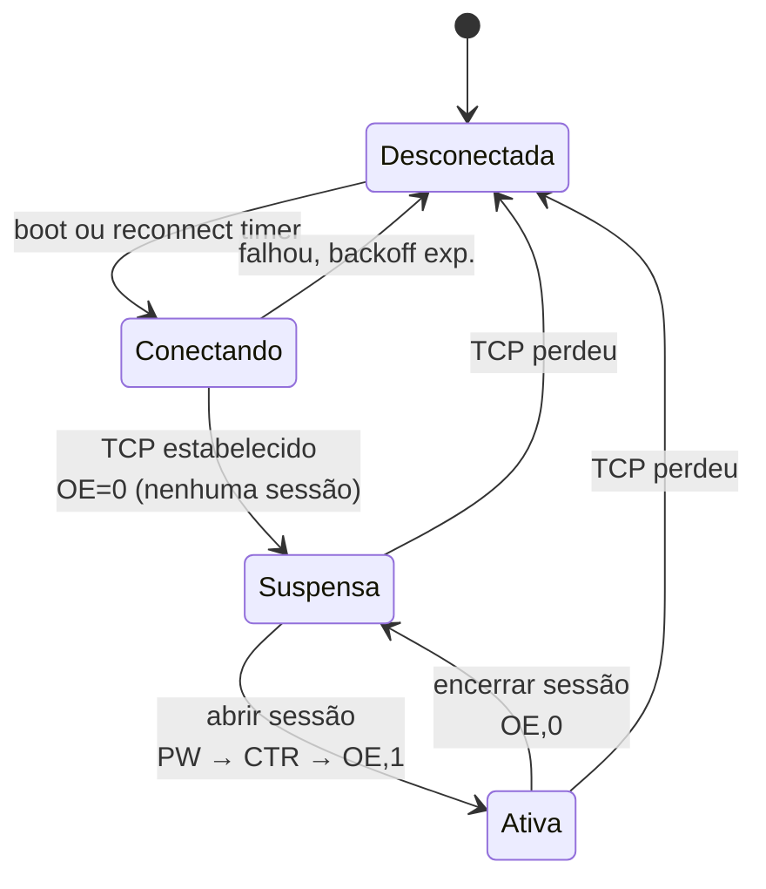
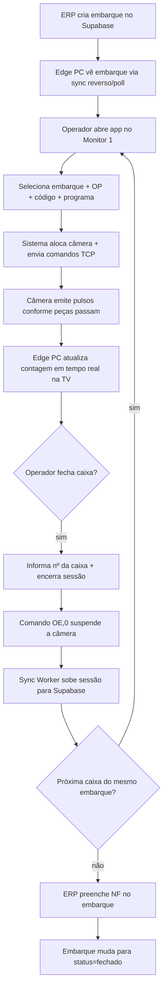

# Sistema de Contagem Rei AutoParts — Arquitetura e Fluxogramas

Documento técnico do MVP. Cobre topologia, módulos, fluxo do operador, fluxo de dados e máquinas de estado.

---

## 1. Visão geral

Sistema **edge-first** para contagem automatizada de peças usando duas câmeras Keyence IV4-600CA. Cada câmera está associada a uma sessão ativa por vez; a contagem acontece localmente no Edge PC e é replicada para o Supabase em segundo plano (*Store-and-Forward*), permitindo operação resiliente a quedas de rede.

### Papéis dos dispositivos

| Dispositivo | Função |
|---|---|
| Edge PC (Windows) | Servidor Node.js, SQLite local, gateway TCP das câmeras |
| Câmera Keyence 1 e 2 | Detecção + emissão de pulsos TCP |
| Monitor 1 | Interface operador (Chrome apontando para localhost) |
| Monitor 2 (TV) | Dashboard em modo kiosk (tempo real via WebSocket) |
| Supabase (self-hosted) | Banco central, alimentado pelo Edge PC + ERP |

---

## 2. Topologia de hardware

```
+--------------+         +--------------+
|  Câmera IV4  |         |  Câmera IV4  |
|   nº 1       |         |   nº 2       |
+------+-------+         +------+-------+
       |  TCP 8500 (pulsos + comandos)  |
       +---------------+----------------+
                       |
                  +----v-----+
                  | Edge PC  |  Node.js + SQLite + WebSocket
                  | Windows  |
                  +----+-----+
                       |
             +---------+---------+
             |                   |
      Monitor 1            Monitor 2 (TV)
      (Operador)           (Kiosk)
                       |
                       | HTTPS (Sync Worker)
                       v
             +-------------------+
             | Supabase cloud    |
             | schema:           |
             | sistema_contagem  |
             +-------------------+
                       ^
                       |
                    ERP (PCP alimenta embarques e OPs)
```

---

## 3. Arquitetura lógica (módulos do Edge PC)

Single-process Node.js. Cada bloco abaixo é um módulo dentro de `src/`.



### Responsabilidades

- **HTTP Server**: REST para o Monitor 1 (embarques, OPs, sessões, relatórios).
- **WebSocket Hub**: broadcast de eventos (`sessao.atualizada`, `contagem.incrementada`, `sync.status`) para as duas UIs.
- **TCP Listener + Keyence Client**: abre conexão TCP com cada câmera, envia comandos (`PW`, `OE`, `CTR`) e interpreta o payload dos pulsos.
- **Camera Manager**: encapsula uma conexão por câmera, reconnect com backoff exponencial, mantém estado (ativa/suspensa).
- **Domain Layer**: regras de negócio — abrir sessão, validar duplicata de caixa, incrementar contagem, encerrar sessão.
- **SQLite**: persistência local (espelho parcial do schema do Supabase + `outbox` para sync).
- **Sync Worker**: máquina de estados ONLINE/OFFLINE/RECOVERY, drena a `outbox` em batches idempotentes.

---

## 4. Fluxo do operador — abertura de sessão



---

## 5. Fluxo do pulso — câmera → UI → cloud



---

## 6. Máquina de estados do Sync Worker

O Sync Worker tem dois loops que respeitam a mesma máquina de estados:
- **Outbox Pusher** — empurra sessões e eventos locais para o Supabase.
- **Reverse Sync Poller** — puxa embarques, OPs e operadores do Supabase a cada 30s (só em ONLINE).



### Reverse Sync Poller — por que existe

Validação de embarque/OP precisa funcionar offline. Solução: SQLite tem tabelas espelho do Supabase (`embarques`, `ordens_producao`, `operadores`), atualizadas via polling com cursor `atualizado_em`. A abertura de sessão sempre lê do SQLite, nunca do Supabase direto. ERP é de baixa frequência (embarques/OPs são criados esporadicamente, não a cada minuto), então 30s de atraso máximo é aceitável.

---

## 7. Máquina de estados da Câmera

Cada câmera tem uma instância do Camera Manager com este ciclo:



---

## 8. Fluxo end-to-end — embarque completo



---

## 9. Princípios arquiteturais

1. **Edge-first, cloud-eventual**: nenhuma operação crítica depende de rede. Sync é assíncrono.
2. **Idempotência em tudo que sobe**: `UNIQUE(origem, id_local)` em eventos; UUID local como PK em sessões.
3. **1 sessão ativa por câmera**: garantido por índice parcial único no PostgreSQL e no SQLite.
4. **Comando antes de escuta**: a câmera só emite pulso depois que o Edge PC mandou `OE,1`. Fora disso, qualquer pulso é ruído e é logado como WARN.
5. **Monólito honesto**: 1 processo Node.js, 6 módulos, comunicação via função. Simplicidade é valor no MVP.

---

## 10. Fora de escopo no MVP

- Autenticação de operador (apenas código).
- Multi-tenant.
- Relatórios em BI externo (somente PDF/XLSX/CSV sob demanda).
- Suporte a mais de 2 câmeras (estrutura permite, UI não).
- Failover do Edge PC.
