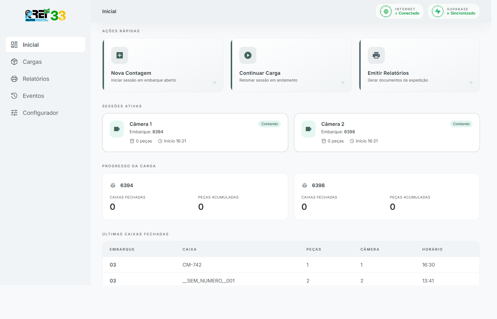
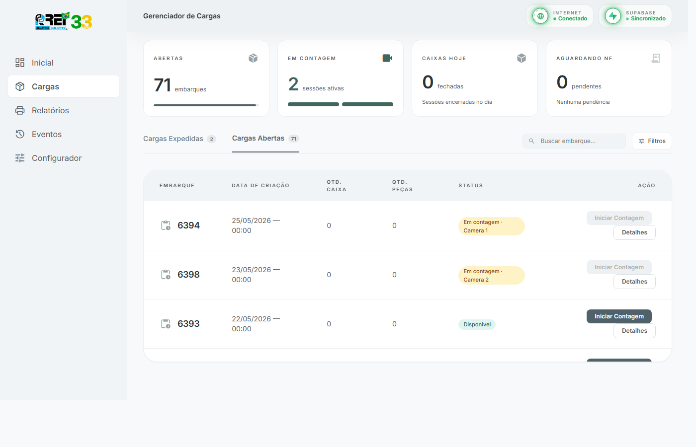
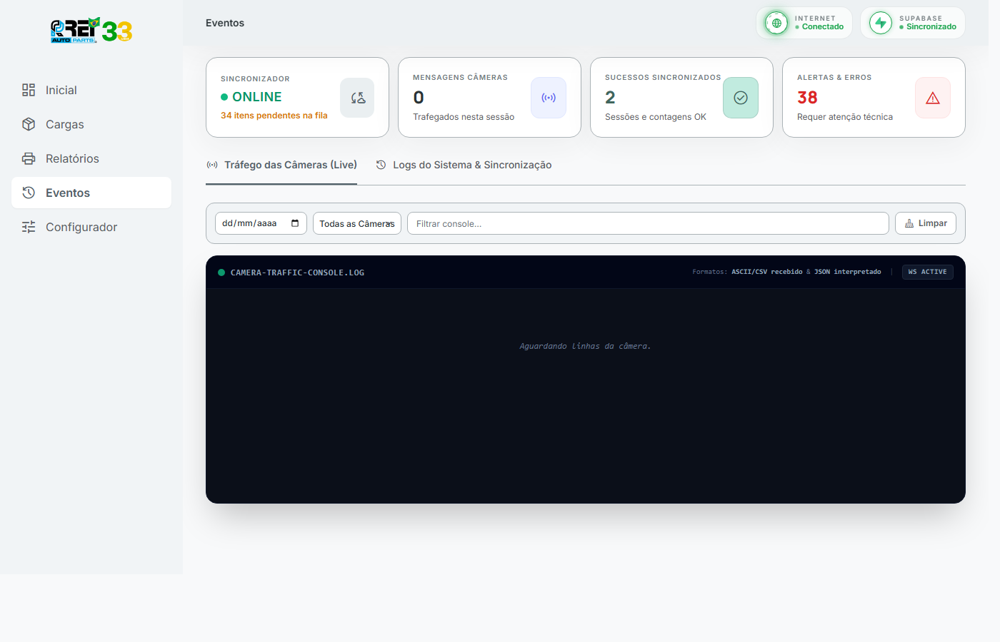
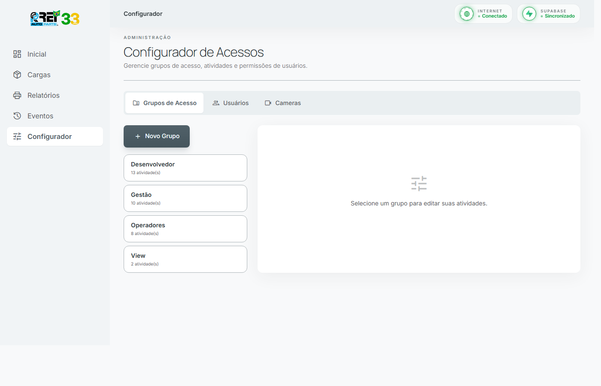
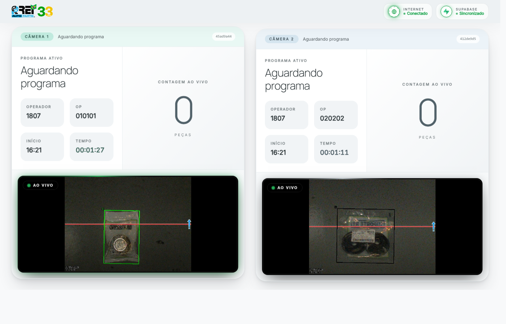

<div align="center">


# Sistema de Contagem Automatizada

**Rei AutoParts — Filial 33**

Sistema edge-first de contagem automatizada para embarques industriais.
Roda no Edge PC (Windows) com câmeras Keyence IV4-600CA, sincroniza com Supabase na nuvem.

[](https://nodejs.org)
[](https://sqlite.org)
[](https://supabase.com)
[](https://microsoft.com)
[](https://fastify.dev)

</div>

---

## 📸 Screenshots

<details>
<summary><strong>Dashboard — Visão Geral</strong></summary>



Ações rápidas, sessões ativas e últimas caixas fechadas em tempo real.

</details>

<details>
<summary><strong>Gerenciador de Cargas</strong></summary>



Embarques abertos com status, filtros e ações de contagem.

</details>

<details>
<summary><strong>Eventos — Tráfego de Câmeras (Live)</strong></summary>



Monitoramento em tempo real: sincronizador online, mensagens trafegadas, alertas e console de câmera.

</details>

<details>
<summary><strong>Configurador de Acessos</strong></summary>



Grupos de acesso (Desenvolvedor, Gestão, Operadores, View), usuários e câmeras.

</details>

<details>
<summary><strong>TV — Modo Kiosk</strong></summary>



Display para monitor de chão de fábrica. Mostra sessão ativa em tela cheia.

</details>

---

## 🏗️ Arquitetura

```
┌─────────────────────────────────────────────────────────────────┐
│                         EDGE PC (Windows)                       │
│                                                                 │
│  ┌──────────┐    TCP/ASCII    ┌──────────────────────────────┐  │
│  │ Câmera 1 │───────────────▶│                              │  │
│  │ IV4-600CA│                 │     Fastify Server           │  │
│  └──────────┘                 │     (porta 3000)             │  │
│                               │                              │  │
│  ┌──────────┐    TCP/ASCII    │  ┌────────┐  ┌───────────┐  │  │
│  │ Câmera 2 │───────────────▶│  │ SQLite │  │ WebSocket │  │  │
│  │ IV4-600CA│                 │  │ (local)│  │  (live)   │  │  │
│  └──────────┘                 │  └────────┘  └───────────┘  │  │
│                               └──────────────────────────────┘  │
│                                          │                      │
└──────────────────────────────────────────│──────────────────────┘
                                           │ Sync (HTTPS)
                                           ▼
                                   ┌──────────────┐
                                   │   Supabase   │
                                   │  (PostgreSQL)│
                                   └──────────────┘
```

**Fluxo:**
1. Câmeras Keyence enviam contagens via TCP (ASCII/CSV)
2. Servidor Fastify processa, valida e persiste no SQLite local
3. Sincronizador envia dados para Supabase em background
4. Frontend SPA atualiza em tempo real via WebSocket

---

## ✨ Funcionalidades

| Módulo | Descrição |
|--------|-----------|
| **Contagem Automatizada** | Recebe dados de 2 câmeras Keyence simultaneamente, conta peças por caixa |
| **Gestão de Cargas** | Cria, acompanha e expede embarques com rastreabilidade completa |
| **Sessões de Contagem** | Inicia/pausa/encerra sessões vinculadas a embarques |
| **Sincronização Cloud** | SQLite local → Supabase (PostgreSQL) com fila resiliente |
| **Relatórios** | Gera documentos de expedição (Excel/PDF) com etiquetas ZPL |
| **Eventos Live** | Console de tráfego de câmera em tempo real + logs de sincronização |
| **Controle de Acesso** | Grupos (Desenvolvedor, Gestão, Operadores, View) com permissões granulares |
| **Modo TV** | Display kiosk para monitor de chão de fábrica |
| **Offline-First** | Funciona 100% sem internet, sincroniza quando reconectar |

---

## 🚀 Instalação

### Via Instalador (Recomendado)

1. Baixe `ReiAutoContagem-Installer.exe` da [última release](../../releases)
2. Execute como **Administrador**
3. Siga o wizard de 4 etapas:
   - Verificação de pré-requisitos (Node.js, Git, Python)
   - Token GitHub (para clone e atualizações)
   - Credenciais Supabase (URL, Anon Key, Service Role Key)
   - Instalação automática com progresso

> O instalador configura tudo: clone, dependências, variáveis de ambiente, PM2 e atalhos.

### Manual (Desenvolvimento)

```bash
# Clonar repositório
git clone https://github.com/suportereipcp/ReiAutoParts-Sistema-ContagemIA.git
cd ReiAutoParts-Sistema-ContagemIA

# Instalar dependências
npm install

# Configurar variáveis de ambiente
cp .env.example .env
# Editar .env com suas credenciais Supabase e IPs das câmeras

# Iniciar em modo desenvolvimento
npm run dev

# Acessar: http://localhost:3000
```

### Variáveis de Ambiente

| Variável | Descrição |
|----------|-----------|
| `GITHUB_TOKEN` | Token para clone e atualizações |
| `NEXT_PUBLIC_SUPABASE_URL` | URL do projeto Supabase |
| `NEXT_PUBLIC_SUPABASE_ANON_KEY` | Chave anônima (frontend) |
| `SUPABASE_SERVICE_ROLE_KEY` | Chave de serviço (admin) |
| `CAMERA_1_IP` / `CAMERA_2_IP` | IPs das câmeras Keyence |

---

## 🛠️ Stack Tecnológica

| Camada | Tecnologia |
|--------|------------|
| **Runtime** | Node.js 20+ (ESM) |
| **Server** | Fastify 5.x + WebSocket |
| **DB Local** | better-sqlite3 |
| **DB Cloud** | Supabase (PostgreSQL) |
| **Frontend** | Vanilla JS SPA (hash router) |
| **Câmeras** | Keyence IV4-600CA (TCP/ASCII) |
| **Relatórios** | ExcelJS + PDFKit |
| **Etiquetas** | ZPL (Zebra) |
| **Process Manager** | PM2 |
| **Instalador** | PowerShell + WPF (.exe) |
| **OS** | Windows 10/11 |

---

## 📁 Estrutura do Projeto

```
├── src/
│   ├── server.js              # Entry point Fastify
│   ├── routes/                # Rotas REST API
│   ├── services/              # Lógica de negócio
│   ├── keyence/               # Driver TCP câmeras
│   ├── sync/                  # Sincronização Supabase
│   └── db/                    # SQLite schemas + queries
├── public/
│   ├── index.html             # SPA principal
│   ├── tv/                    # Modo TV (kiosk)
│   └── app.js                 # Frontend router + componentes
├── installer/
│   ├── wpf/                   # Instalador WPF (.exe)
│   └── README.md              # Docs do instalador
├── docs/
│   ├── html-docs/             # Documentação HTML
│   ├── screenshots/           # Capturas de tela
│   └── instalador-wpf.md      # Docs Obsidian
└── tests/                     # Testes automatizados
```

---

## 🧪 Scripts Disponíveis

```bash
npm run dev          # Servidor com hot-reload (--watch)
npm start            # Produção
npm test             # Testes
npm run test:watch   # Testes em modo watch
npm run fake-keyence # Simula câmera para desenvolvimento
npm run ping-keyence # Testa conexão com câmera real
```

---

## 📖 Documentação

- [Arquitetura Completa](ARQUITETURA.md)
- [API REST](docs/html-docs/api.html)
- [Controle de Acesso](docs/html-docs/acesso.html)
- [Etiquetas ZPL](docs/html-docs/etiquetas.html)
- [Instalador WPF](docs/instalador-wpf.md)
- [Specs Técnicas](docs/superpowers/specs/)

---

<div align="center">

**Rei AutoParts** — Sistema de Contagem Automatizada
Desenvolvido para operação industrial 24/7

</div>
