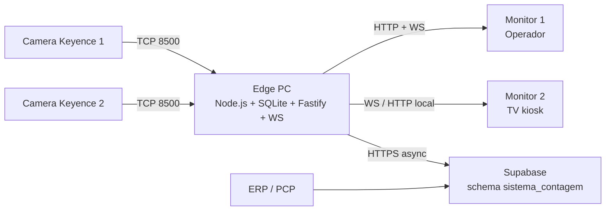

---
tags:
  - arquitetura
  - edge
fontes:
  - ARQUITETURA.md
  - estrutura_sistema.md
  - AGENTS.md
atualizado_em: 2026-04-22
---

# Arquitetura Edge-First

## Direcao arquitetural

O sistema foi desenhado para operar no chao de fabrica com o minimo de dependencia externa. O Edge PC executa backend, persistencia local, integracao TCP com as cameras e atualizacao das telas. A nuvem entra como camada de consolidacao e nao como dependencia da operacao critica.

## Topologia resumida

## Modulos locais

| Modulo | Funcao principal |
|---|---|
| `src/config.js` | valida `.env` e centraliza configuracao |
| `src/db/` | SQLite local, migrations e queries |
| `src/camera/` | cliente TCP, parser e camera manager |
| `src/domain/` | regras de negocio de sessao e contagem |
| `src/http/` | REST do operador e WebSocket hub |
| `src/sync/` | outbox pusher, reverse poller e state machine |
| `scripts/` | ferramentas locais para fake, ping e kiosk |

## Invariantes criticos

- apenas uma sessao ativa por camera;
- a camera so deve contar apos `OE,1`;
- toda leitura operacional relevante vem do SQLite local;
- sync deve ser idempotente;
- queda de rede nao pode parar a contagem.

## Observacoes da documentacao

- `ARQUITETURA.md` e a melhor fonte para topologia e diagramas.
- `estrutura_sistema.md` reforca o racional edge computing e a visao de contingencia.
- `AGENTS.md` consolida a mesma arquitetura em formato operacional para desenvolvimento.

## Navegacao complementar

- [[02 - Arquitetura/Fluxos Operacionais]]
- [[02 - Arquitetura/Dados e Sincronizacao]]
