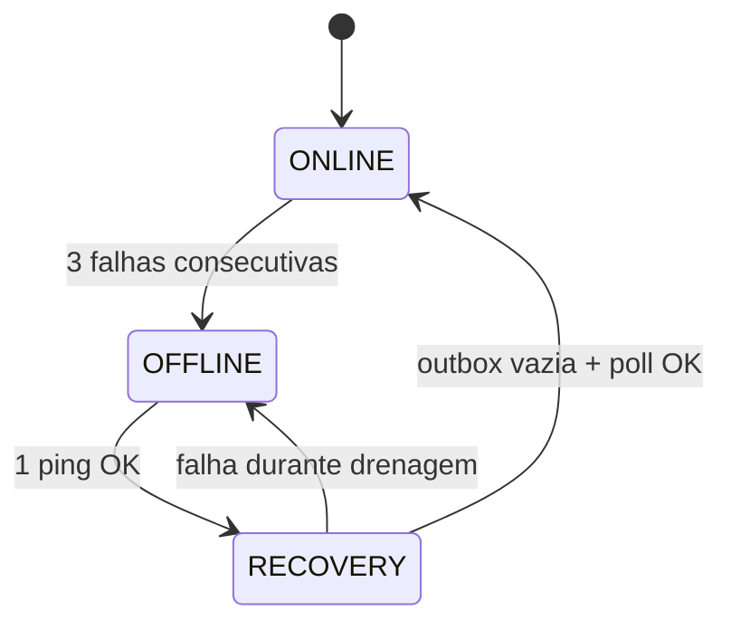

---
tags:
  - arquitetura
  - dados
  - sync
fontes:
  - ARQUITETURA.md
  - AGENTS.md
  - docs/superpowers/specs/2026-04-17-sistema-contagem-rei-autoparts-design.md
atualizado_em: 2026-04-22
---

# Dados e Sincronizacao

## Banco local

O SQLite em `data/contagem.db` e a fonte operacional do Edge PC. Ele guarda tanto dados gerados localmente quanto tabelas espelho trazidas do Supabase.

### Grupos de dados locais

| Grupo | Tabelas | Origem |
|---|---|---|
| escrita local | `sessoes_contagem`, `eventos_log` | Edge PC |
| espelho | `embarques`, `ordens_producao`, `operadores` | Supabase / ERP |
| infraestrutura | `outbox`, `sync_cursor` | Sync Worker |

## Banco em nuvem

- Supabase self-hosted;
- schema unico: `sistema_contagem`;
- escritas permitidas apenas dentro desse schema;
- migrations cloud ficam em `supabase/migrations/` e nao devem ser aplicadas pelo codigo do app.

## Mecanismo de store-and-forward

1. o dominio grava a sessao e o evento no SQLite;
2. a outbox recebe o payload pendente;
3. o pusher envia para o Supabase em segundo plano;
4. somente apos `2xx` o item e marcado como sincronizado.

## Reverse sync

O sistema precisa abrir sessao mesmo offline, entao embarques, OPs e operadores sao trazidos do Supabase para o SQLite em ciclos de polling.

- ONLINE: poll a cada 30s;
- OFFLINE: poll pausado;
- RECOVERY: drena outbox e roda um ciclo completo de atualizacao.

## State machine do sync

## Garantias importantes

- idempotencia com `UNIQUE(origem, id_local)` em eventos;
- UUID local como chave da sessao;
- indice parcial para bloquear 1 sessao ativa por camera;
- leitura de abertura sempre local, nunca diretamente do Supabase.

## Tratamento de erro consolidado

| Origem | Reacao |
|---|---|
| HTTP 5xx / timeout da nuvem | mantem na outbox e conta falha |
| HTTP 4xx | vai para tratamento local e nao deve ficar retentando indefinidamente |
| queda de TCP da camera | reconnect com backoff exponencial |
| payload invalido | descarta e loga erro |
